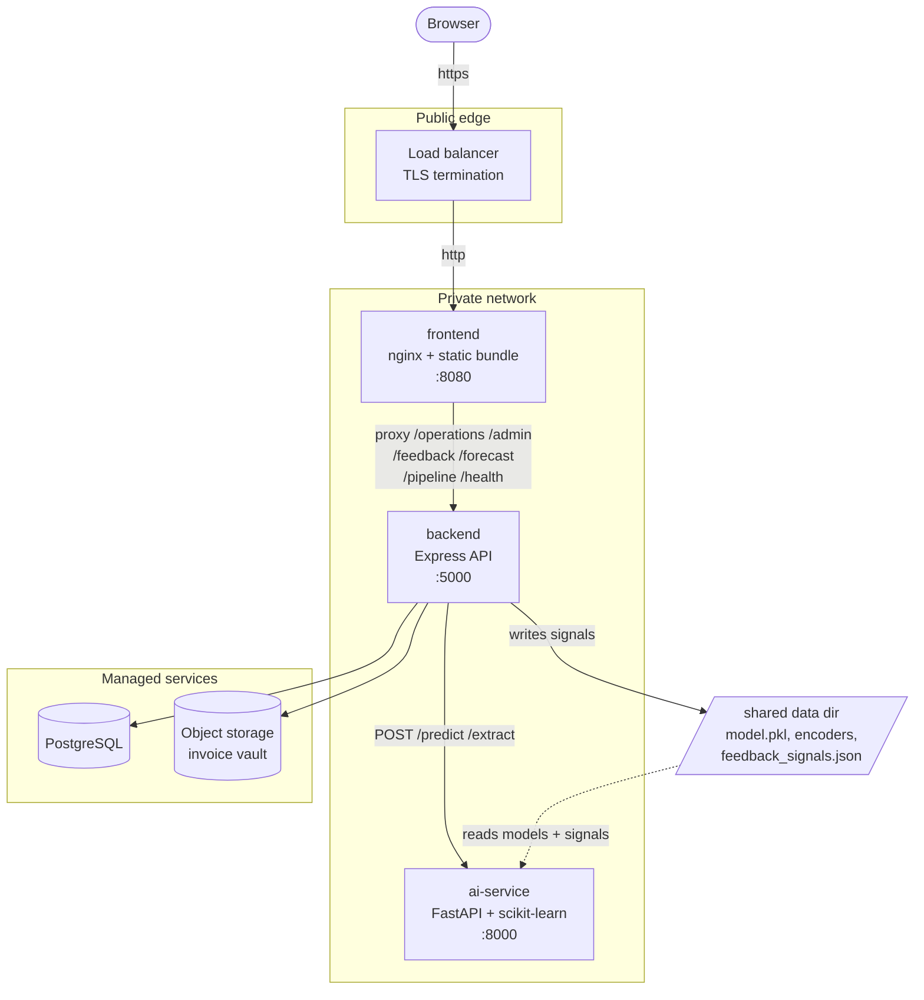

# Deployment

How ZeroWaste AI is built, configured and rolled out. Read
[Go-live blockers](#go-live-blockers) first — the application is **not yet
safe to expose to the internet**, and that is a deliberate, documented state
rather than an oversight.

- [Architecture](#architecture)
- [Go-live blockers](#go-live-blockers)
- [Images](#images)
- [Configuration](#configuration)
- [Database](#database)
- [Object storage](#object-storage)
- [Health checks](#health-checks)
- [Logging](#logging)
- [Graceful shutdown](#graceful-shutdown)
- [Rollout](#rollout)
- [Rollback](#rollback)
- [The Postgres cutover](#the-postgres-cutover)
- [Runbook](#runbook)

---

## Architecture



### Why the shape is this shape

**The frontend proxies the API rather than calling it cross-origin.** The
browser makes same-origin requests, so there is no preflight on any call and
the CORS allowlist matters only for genuinely external callers. It also means
one hostname, one certificate, and one thing to point DNS at.

**The AI service is not reachable from outside.** It performs no
authentication of any kind — by design, because it is meant to be unreachable.
Publishing it would let anyone run prediction and PDF-extraction workloads
against the model. `docker-compose.prod.yml` gives it no `ports` entry, and CI
asserts that this stays true.

**The AI service is a separate service rather than a spawned subprocess.**
Model inference and pdfplumber extraction have completely different resource
profiles from an Express request handler: a 200-PDF import holds hundreds of
megabytes for a minute, while the API is thousands of small, fast requests.
Sharing a process means the memory ceiling for both is set by the worse of the
two, and one large import degrades every concurrent booking request.

Both transports still exist. `AI_SERVICE_URL` unset spawns `predict.py` as a
child process, which is what local development and the entire test suite use;
setting it switches to HTTP. That difference lives in exactly one file,
[`backend/lib/aiService.js`](../backend/lib/aiService.js), and `predict.py` is
shared by both — one implementation, two ways of reaching it.

---

## Go-live blockers

**The security audit found five critical issues. None are fixed by this
deployment work.** Fixing them means replacing the authentication model, which
is a separate change with its own review. What deployment *does* guarantee is
that the unsafe defaults cannot reach production silently — the server refuses
to boot with them.

That guarantee is narrower than it sounds. Read this table as: *the following
are still true even after a correct production deployment.*

| # | Issue | Effect | Status |
|---|---|---|---|
| **C1** | Login is a client-side role picker | `localStorage["zerowaste-role"] = "admin"` in a browser console grants the admin application. There is no server-side session. | **Open.** Needs real authentication. |
| **C2** | Admin token is a single shared secret, compiled into the frontend bundle | Every user of the admin app holds the same credential, and it is readable in the served JavaScript. Rotating it logs everyone out. | **Guarded, not fixed.** The committed default is rejected at boot; a unique token is still a shared, extractable token. |
| **C3** | `POST /operations/bookings` and `POST /feedback` are unauthenticated | Anyone can create a booking or submit feedback as any `employeeId`. Feedback moves the portion multipliers the kitchen cooks to. | **Open.** |
| **C4** | IDOR on `/operations/bookings/me`, `/feedback/me`, `/operations/impact/me` | The employee identity is a query parameter. Supplying somebody else's returns their data. | **Open.** |
| **C5** | `predict.py` applies the minimum-sample threshold to the menu-family and weekday buckets but not the global fallback | A handful of early responses can move every forecast. | **Open.** |
| **H2** | No rate limiting | The prediction and extraction endpoints are computationally expensive and uncapped. | **Open.** Out of scope for this change. |

See [`SECURITY_AUDIT.md`](../SECURITY_AUDIT.md) for the full findings.

### What this means in practice

Until C1–C4 are resolved, ZeroWaste AI may be deployed to an environment that
is **already access-controlled** — an internal network, a VPN, or behind an
authenticating reverse proxy (SSO, an identity-aware proxy, mTLS). It must not
be published on a public hostname. The `CORS_ALLOWED_ORIGINS` guard prevents
one specific mistake; it is not a substitute for authentication.

---

## Images

Three images, all built from the repository root as context.

| Image | Dockerfile | Base | Runs as |
|---|---|---|---|
| `zerowaste-backend` | [`docker/backend.Dockerfile`](../docker/backend.Dockerfile) | `node:24.11.1-alpine` | uid 10001 |
| `zerowaste-frontend` | [`docker/frontend.Dockerfile`](../docker/frontend.Dockerfile) | `nginx-unprivileged:1.27-alpine` | uid 101 |
| `zerowaste-ai-service` | [`docker/ai-service.Dockerfile`](../docker/ai-service.Dockerfile) | `python:3.12.8-slim-bookworm` | uid 10001 |

```bash
npm run docker:build      # all three
```

### Decisions worth knowing about

**Node 24 is a requirement, not a preference.** jsdom's bundled undici calls
`webidl.util.markAsUncloneable`, which does not exist on Node 20 — the frontend
suite cannot start a worker there. CI, the Dockerfile and local development are
pinned to the same major deliberately.

**Base images are pinned to a patch version.** A rebuild of a release should
produce the same thing. For a release you intend to keep, pin the digest too
(`node:24.11.1-alpine@sha256:...`); even an exact tag is mutable on the
registry.

**dumb-init and tini are PID 1.** A process running as PID 1 does not get the
default signal handlers, so an unhandled `SIGTERM` terminates it immediately —
which would defeat the graceful shutdown below on every single deploy.

**`HEALTHCHECK` checks liveness only.** See [Health checks](#health-checks).

**Model artefacts are mounted, not baked.** `model.pkl` and both encoders are
loaded from `ZEROWASTE_DATA_DIR` at import. Models are retrained on a different
cadence than code is released; baking them means a retrain requires a rebuild
and a redeploy.

> [!IMPORTANT]
> **The backend and the AI service must share one data directory.**
> `predict.py` re-reads `feedback_signals.json` on every request, and that file
> is *written by the backend* whenever feedback is submitted. Give the two
> services separate directories and the forecast silently stops responding to
> feedback — the service keeps serving predictions from whatever signals
> existed when its directory was created, with no error anywhere.
>
> Compose mounts `./data` into both, read-only for the AI service. On a
> multi-host platform this needs shared storage (ReadWriteMany, EFS) until the
> [Postgres cutover](#the-postgres-cutover) turns signals into a table.

**Nothing runs as root, and CI asserts it.** A Dockerfile that builds is not a
Dockerfile that is safe to run, and a `USER` directive is easy to lose in a
later edit.

---

## Configuration

Every variable is read in one place,
[`backend/lib/config.js`](../backend/lib/config.js), and documented in
[`.env.example`](../.env.example).

**The server validates its configuration before opening a port.** In production
an invalid configuration is fatal: it exits `78` (`EX_CONFIG`) with *every*
problem listed at once, so one restart reveals the whole picture rather than
turning a misconfigured deploy into a sequence of deploys.

Rejected in production:

- either committed development secret, matched exactly
- any secret shorter than 32 characters
- an empty `CORS_ALLOWED_ORIGINS`, `*`, an entry with a path, or a plaintext
  `http://` origin that is not loopback
- `STORAGE_DRIVER=local` without `STORAGE_ALLOW_LOCAL=true`
- a missing `ZEROWASTE_DATA_DIR`

These rules are tested in
[`backend/tests/unit/config.test.js`](../backend/tests/unit/config.test.js) and
the wiring is asserted in CI, because every other test in the suite runs with
`NODE_ENV=test`, where all of this is deliberately skipped — a refactor could
remove a rule without any other test noticing.

### Generating secrets

```bash
node -e "console.log(require('crypto').randomBytes(32).toString('base64url'))"
```

`FEEDBACK_HASH_SALT` is the pepper for the employee-ID hash. **Changing it
after data exists orphans every previous hash** and silently breaks the
"have I already responded" check. Treat it as permanent per environment and
rotate only alongside a re-hash migration.

### Never commit real secrets

`.gitignore` ignores `.env*` and re-includes only `.env.example`. Ignoring just
`.env` would let `.env.production` be committed by accident, which is the file
most likely to hold a working credential. CI runs gitleaks over full history
and separately asserts that `.env.example` contains no filled-in values.

Anything prefixed `VITE_` is **inlined into the JavaScript bundle** at build
time and served to every visitor. Never put a secret behind that prefix.

---

## Database

PostgreSQL 17. Migrations are forward-only `.sql` files in
[`backend/migrations/`](../backend/migrations/), applied by
[`backend/scripts/migrate.js`](../backend/scripts/migrate.js).

```bash
npm run migrate          # apply everything pending
npm run migrate:check    # report pending, change nothing; non-zero if any
```

**Migrations run as a separate step, not on server boot.** Migrating on boot
means every replica in a rolling deploy attempts it, and means the
application's database role needs DDL rights permanently. A separate job can
use a privileged role while the long-running service connects with one that can
only read and write rows.

The runner is safe to run concurrently anyway — it takes
`pg_advisory_lock(8323127)` first, so replicas queue rather than race — but
"safe" is not a reason to grant permissions that are not needed.

Each migration runs in its own transaction, so a failure part-way leaves the
earlier ones applied and recorded and a re-run resumes. Applied files are
checksummed; editing one that has already run is refused rather than silently
ignored, because the database and the file would then disagree with no way to
tell.

`migrate:check` exists as a deploy gate: a pipeline can refuse to promote an
image whose schema has not been applied, without the pipeline itself holding
rights to alter the database.

---

## Object storage

The invoice vault holds original supplier PDFs, addressed by SHA-256 content
hash. Two drivers, behind
[`backend/lib/storage/objectStore.js`](../backend/lib/storage/objectStore.js).

`STORAGE_DRIVER=local` writes to `ZEROWASTE_DATA_DIR`. That is correct for one
container with a persistent volume and **quietly wrong for two** — a replica
that did not receive the upload cannot serve it back, so a proportion of
requests fail depending on which replica answers. Production rejects it unless
`STORAGE_ALLOW_LOCAL=true` states that the single-replica constraint is
understood.

`STORAGE_DRIVER=s3` is S3 or any compatible gateway. Prefer leaving
`STORAGE_ACCESS_KEY_ID` and `STORAGE_SECRET_ACCESS_KEY` **unset** and attaching
an instance role or Kubernetes service account — the SDK's default credential
chain finds it, and a role that rotates itself is not a key that can be copied
out of an environment listing.

The bucket must be **private, versioned, and encrypted at rest**. It holds
commercial invoices. Versioning matters because the vault is content-addressed
and therefore append-only in intent; versioning makes that true in fact.

---

## Health checks

Three endpoints, from [`backend/lib/health.js`](../backend/lib/health.js).

| Endpoint | Checks | Use for |
|---|---|---|
| `/health/live` | **Nothing.** Only that the process answers. | Docker `HEALTHCHECK`, Kubernetes liveness probe |
| `/health/ready` | Postgres, object storage, AI service — all in parallel. 503 if any fails, 503 `draining` while shutting down. | Load balancer target, Kubernetes readiness probe |
| `/health/info` | Non-secret configuration. Secrets reported as booleans. | Confirming what a running instance is configured with |

**The distinction is load-bearing.** A liveness probe that consults Postgres
will fail every replica during a database outage, and the orchestrator will
restart them — turning a recoverable dependency failure into a fleet-wide crash
loop that restarting cannot fix. Liveness answers "is this process wedged".
Readiness answers "should traffic come here right now". Only the second should
depend on anything external.

`/health/info` is unauthenticated, which is why `describeConfig` reports
whether a secret is set and never what it is.

---

## Logging

Structured JSON lines to stdout in production; human-readable in development.
[`backend/lib/logger.js`](../backend/lib/logger.js).

```json
{"time":"2026-01-01T00:00:00.000Z","level":"info","service":"zerowaste-backend",
 "version":"a1b2c3d","requestId":"...","msg":"request completed",
 "method":"GET","route":"/operations/bookings/me","status":200,"durationMs":12}
```

**Request IDs.** A valid inbound `X-Request-Id` is adopted, otherwise one is
generated; either way it is echoed in the response header and attached to every
log line in that request via `AsyncLocalStorage`, so a user reporting an error
gives you an ID that finds every line the request produced.

**Route patterns are logged, not paths.** `/operations/bookings/me` and
`/invoices/raw/:hash`, never the concrete URL or the query string. This is not
cosmetic: `?employeeId=` and the content hash of a supplier invoice would
otherwise be written to the aggregator on every request, which is exactly the
personal and commercial data the hashing exists to avoid storing.

**Sensitive keys are redacted centrally**, at any depth, including
`employeeId` and `employeeHash`. Redaction at the call site is redaction that
somebody will forget.

`APP_VERSION` should be set to the commit SHA so a report can be tied to a
release.

---

## Graceful shutdown

On `SIGTERM`, [`backend/lib/shutdown.js`](../backend/lib/shutdown.js):

1. **Fails readiness immediately** — `/health/ready` starts returning 503.
2. **Waits `SHUTDOWN_GRACE_MS`** while continuing to serve.
3. Closes the listener and idle keep-alive connections.
4. Closes the database pool and storage client.
5. Exits. A hard deadline forces exit if a request hangs; a second signal exits
   at once.

**Step 2 is the one that matters and the one usually omitted.** Closing the
listener first produces 502s, because the load balancer has not yet noticed the
instance is going away and keeps routing to it. Failing readiness first and
then waiting gives it time to deregister, so the connections that arrive during
the window are still served.

`SHUTDOWN_GRACE_MS` **must exceed the load balancer's deregistration delay**.
Default 10s locally, 15s in the production overlay. If in-flight requests are
being severed during deploys, this value is too low.

`server.keepAliveTimeout` (65s) must likewise exceed the balancer's idle
timeout, or the balancer reuses a connection this process is closing and the
client sees a 502.

---

## Rollout

```bash
cp .env.example .env        # then fill it in
npm run docker:up           # local stack, including Postgres and MinIO
```

Production, on a single host:

```bash
docker compose -f docker-compose.yml -f docker-compose.prod.yml up -d
```

The production overlay supplies **no defaults**. Compose fails to start if a
required variable is missing, which is intended: a production stack that
silently falls back to a development credential is the failure mode this whole
configuration exists to prevent.

### Order

1. **Migrate.** `npm run migrate` — or the `migrate` service, which the backend
   waits on via `service_completed_successfully`. Migrations must be backward
   compatible with the *currently running* version, because for the duration of
   a rolling deploy both versions are live against one schema. Add columns,
   don't rename them; drop only after the release that stopped using them has
   fully rolled out.
2. **Deploy the AI service**, and wait for `/health/live`.
3. **Deploy the backend.** It will not accept traffic until `/health/ready`
   passes, which requires Postgres, storage and the AI service.
4. **Deploy the frontend.** The bundle is static; the only coupling to the
   backend is the set of proxied paths in
   [`docker/nginx.conf.template`](../docker/nginx.conf.template).

### Verifying

```bash
curl -fsS http://localhost:8080/healthz            # nginx itself
curl -fsS http://localhost:5000/health/live
curl -fsS http://localhost:5000/health/ready | jq
curl -fsS http://localhost:5000/health/info | jq   # confirm nodeEnv, version
```

`/health/info` should report `"nodeEnv":"production"` and the expected
`version`. If it reports `development`, `NODE_ENV` did not reach the container
and none of the production guards are active.

---

## Rollback

The application is stateless; state is in Postgres and object storage.

**Code:** redeploy the previous image tag. This is why `APP_VERSION` is a
commit SHA and why images are pinned rather than floating on `latest`.

**Schema:** there are no down migrations, deliberately. A down migration is
written when the schema is understood and run when it is not — during an
incident, against data the developer who wrote it never saw. Recovering a bad
migration means restoring from a snapshot, or writing a new forward migration
that corrects it. Take a snapshot before migrating; that is the actual rollback
plan.

This is also why step 1 above insists migrations stay backward compatible: if
the new schema still works with the old code, rolling back the code is
sufficient and the schema never needs to move.

---

## The Postgres cutover

**The application currently reads and writes JSON files**, not Postgres. The
schema, the migrations, the pool and the repository interface all exist and are
exercised in CI, but
[`backend/lib/db/repositories.js`](../backend/lib/db/repositories.js) still
delegates to the JSON stores.

This was a deliberate split. The deployment skeleton — images, configuration,
health, shutdown, migrations, CI — is independently useful and independently
reviewable. Rewriting nine stores (~1,090 lines) in the same change would have
meant reviewing both at once, and the data layer is where a subtle mistake
loses real booking history.

`REPOSITORY_DRIVER=postgres` **throws "not implemented"** rather than falling
back to JSON. A silent fallback would hide that the cutover has not happened,
which is precisely the thing you most need to know.

Remaining work:

1. Implement the Postgres side of each repository method.
2. A backfill that reads the JSON stores and writes the tables, idempotently.
3. Run both in parallel and compare, for at least one full service cycle.
4. Flip `REPOSITORY_DRIVER`, keeping the JSON files until confidence is earned.

It also removes the shared-data-directory coupling described under
[Images](#images): once `feedback_signals.json` is a table, the AI service
needs only the model artefacts and the two services stop sharing a filesystem.

---

## Runbook

**Backend exits immediately with code 78.** Invalid configuration. The log
lists every problem. Check `NODE_ENV`, both secrets, and
`CORS_ALLOWED_ORIGINS`.

**`/health/ready` returns 503 but `/health/live` is fine.** Working as
intended — a dependency is down. The response body names which. Do not restart
the container; restarting cannot fix Postgres.

**Browser console shows CORS errors.** The origin is not in
`CORS_ALLOWED_ORIGINS`. Entries are exact `scheme://host[:port]` with no
trailing path or slash. If the frontend is served by the nginx container, it
should be making same-origin requests and reaching CORS at all means
`VITE_API_BASE` was baked in when it should have been empty.

**Invoice upload succeeds but the PDF cannot be retrieved later.**
`STORAGE_DRIVER=local` with more than one replica. Move to `s3`.

**Prediction requests time out.** Check the AI service's `/health/live` and its
memory limit. A large extraction batch can exhaust it; `AI_SERVICE_TIMEOUT_MS`
defaults to 20s, which a 200-PDF import will exceed.

**Forecasts stop responding to feedback.** The AI service is not reading the
same `feedback_signals.json` the backend writes. Confirm both containers
resolve `ZEROWASTE_DATA_DIR` to the same underlying storage.

**Deploys sever in-flight requests.** `SHUTDOWN_GRACE_MS` is below the load
balancer's deregistration delay. Raise it above.

**Migrations hang.** Another instance holds the advisory lock, or a long
transaction blocks DDL. Check `pg_stat_activity` and `pg_locks`.
